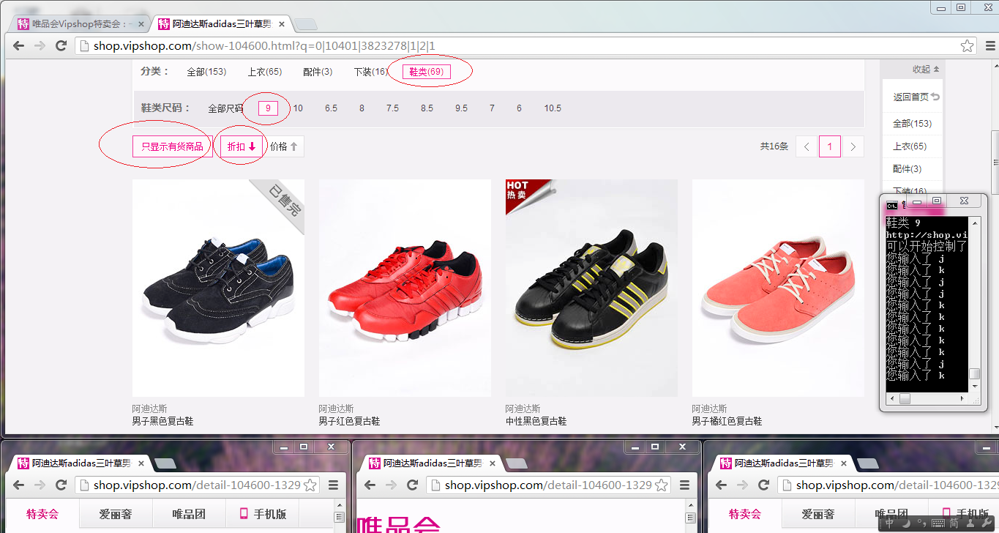
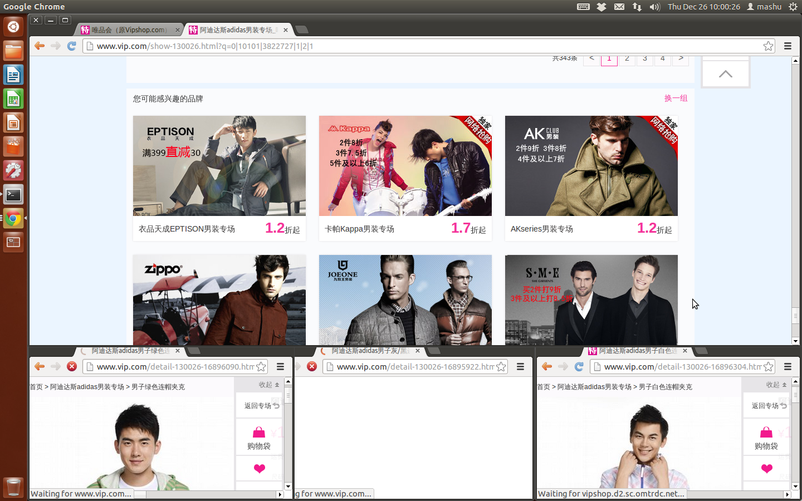
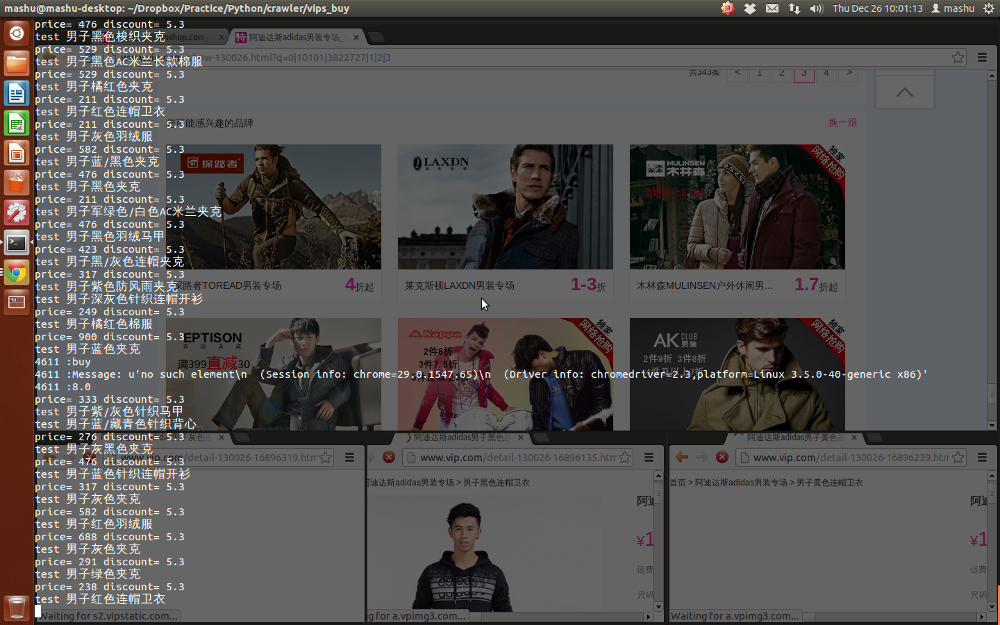

#vip.com Shopping Assistant

## Notice

2014.04.21 :  
这几天登陆发现，唯品会登陆的时候，加上验证码了，我不会破解验证码，只能用户手动输入了！！

## Requirement
```
pip install -U selenium
```

## Two Modes
* 自选模式  
配置config.ini，运行软件，键盘控制购买哪些看中的物品。  
打开方式：设置config.ini中auto_pick下的AutoPickMode=False。  
* 全自动模式  
配置config.ini，运行软件，自动购买符合过滤条件的物品。  
打开方式：设置config.ini中auto_pick下的AutoPickMode=True。  

## Configuration  
`config_w.int`配置文件用于动态设置超时时间，不需要手动修改。
`config.ini`配置文件分为url，screen，auto_pick，config，type，size，empty，sort几个section。  
###url 
包括登陆界面和主页的url，一般不需要动。  
###screen  
配置屏幕和选购窗口的大小安排，一般默认即可。  
###auto_pick  
  
* 【AutoPickMode】：可选值是True或False。  
选择True，将使软件进入**全自动模式**，auto_pick部分配置的其他选项才有意义。  
选择False，则直接忽略auto_pick部分的其余配置，进入**自选模式**。  
  
*  【PriceSpan】：价格区间，半角逗号分割  
  
* 【DisSpan】：折扣区间，半角逗号分割  
  
* 【Excepts】【Keywords】  
因为是全自动模式，进入某个品牌的页面之后，软件需要根据条件进行筛选，Keywords是必须包含的关键字，Excepts必须过滤的关键字。  
例子：  
```ini  
PriceSpan=100,300  
DisSpan=0,5  
Excepts=POLO,T恤,紫  
Keywords=男  
```  
解释：软件会筛选价格在￥100~300之间，折扣在0~5之间，商品标题中包含“男”并且不包含“POLO”、”T恤”和”紫”的商品。  
  
###config  
  
* 【TestMode】：可选值是True或False。  
非正式使用，只是为了熟悉本软件操作方式的时候，设置成False，会跳过刷新首页环节，直接进入所关注的品牌内。  
正式使用，一定记得设置成True，这样软件才会每隔5s刷新首页等待商品更新。  
  
* 【Account】：自己vipshop的账户和密码（冒号分割用户密码，多个账户密码换行即可）  
之所以要用多个，是因为一个帐号购物袋中最多只能放10个商品，当海选商品的时候，可能10个并不够。况且这样也能加快购买的速度，建议最少两个帐号。  
  
* 【Keys】：首页品牌的筛选关键字，空格隔开  
例子：`Keys=男 鞋`  
解释：首页品牌描述中只有既包括‘男’又包括'鞋'这两个关键字的才可以匹配上。  
  
* 【Brands】：中意的品牌，空格隔开  
例子：`Brands=Nike adidas 七匹狼`  
解释：首页品牌描述中包括 'Nike' ， ’adidas‘ 或 '七匹狼' 其中之一就可以匹配上。  
  
* 【Type】【Size】【Empty】【Sort】  
这几个选项，对应下图中画圈部分。其中，Type和Size的值可以包含多个，空格隔开，但是Type和Size中的值要在对应位置一一对应。  
  

例子：  
```ini  
[type]  
Type=上衣 鞋类 男包  
…  
[size]  
Size=XL 9 均码  
```  
解释：有时候，你喜欢的品牌有多种商品，你比较感兴趣，比如XL的上衣，9号的鞋，还有均码的男包。这时候，你可以配置成例子所示。  
程序会先进入"上衣 XL"的商品页面。一旦属于这一类的商品都浏览完毕，就会进入"鞋类 9"的商品页面，最后才会进入"男包 均码"页面。  


## Usage  
### Steps
0. 将dist/下的chromedriver放到PATH中指定的目录下，或者添加本目录进PATH(windows下没有此步骤)。  
1. 修改配置文件config.ini。  
2. 9点55左右(10点新品开卖)，执行python master.py（windows下双击运行dist/master.exe）。软件会弹出1个选购窗口和多个购买窗口。  
3. 如果是自选模式，等待进入品牌商品页，通过在命令行窗口下输入1、2、3、4、j、k键控制选择过程。如果是全自动模式，则免去此步骤。  
4. 软件退出，自己在购物袋中选择付款购买。  

PS:此软件配合本站的vipshop-notice一起使用，效果更佳~  

### Commands
自选模式需要在终端窗口内输入命令,如下
导航窗口：  
j ——窗口向下滚动一行  
k——窗口向上滚动一行  
选择当前所在行的物品：  
1——选择最左边的商品  
2——选择第2个商品  
3——选择第3个商品  
4——选择最右边的商品  
退出：  
q——在选择商品的过程中，输入q，退出程序。购物袋中有物品的窗口最大化，没有物品的窗口直接退出。  

### ScreenShots


